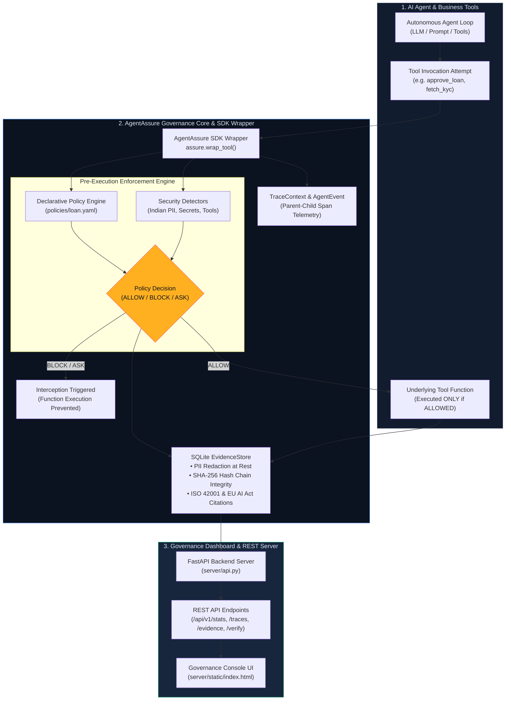

# AgentAssure — Runtime Governance & Assurance Layer for AI Agents

> **Week-1 Technical Specification & Source of Truth**  
> *Post-Dashboard Integration & Core Architecture Refactoring*

AgentAssure is a **runtime governance and assurance layer** that attaches to an existing AI agent. It does **not** replace an agent's business logic. The agent carries out its normal autonomous tasks while AgentAssure observes execution, evaluates actions against configurable governance policies, intervenes **before** sensitive actions execute, and records auditable, tamper-evident evidence.

---

## System Architecture & Integration Flow

The diagram below visualizes how the three core entities—the **AI Agent & Business Tools**, the **AgentAssure SDK & Governance Core**, and the **Governance Dashboard & REST Server**—interlink and flow data seamlessly across the system:



---

## Executive Summary

| Capability | What AgentAssure Does | Value / Compliance Standard |
| :--- | :--- | :--- |
| **Observe** | Normalizes all agent execution into canonical `AgentEvent` traces with parent-child span tracking. | Full execution visibility & audit trail |
| **Govern** | Evaluates tool calls against declarative YAML policies and real-time security detectors. | Configurable boundaries & thresholds |
| **Enforce** | Pre-execution interception (`ALLOW`, `BLOCK`, `ASK`). Guarantees blocked tools never execute. | Prevents rogue agent actions |
| **Assure** | Maintains a SHA-256 tamper-evident append-only hash chain with data minimisation masking at rest. | ISO 42001 (A.8.4, A.9.4) & EU AI Act (Art. 10, 14) |
| **Console** | Zero-build, single-process FastAPI dashboard (`/`) displaying live stats, traces, and hash integrity. | Real-time governance dashboard |

---

## Layer-by-Layer Architecture

AgentAssure is structured into five clean, decoupled layers with strict separation of concerns:

```text
┌─────────────────────────────────────────────────────────────────────────────────────────┐
│ LAYER 1: DEVELOPER SDK & GOVERNANCE CORE (agentassure/)                                │
│ • AgentAssure (sdk.py)               • AgentEvent & TraceContext (events.py, trace.py) │
│ • PolicyEngine (policy.py)           • Detectors (detectors.py - Indian PII, Secrets)  │
│ • EnforcementEngine (enforcement.py) • EvidenceStore (evidence.py - SHA-256 Hash Chain) │
└───────────────────────────────────────────┬─────────────────────────────────────────────┘
                                            │
                                            ▼
┌─────────────────────────────────────────────────────────────────────────────────────────┐
│ LAYER 2: REST API & GOVERNANCE CONSOLE SERVER (server/)                                 │
│ • FastAPI Backend (server/api.py)     • Dashboard Web UI (server/static/index.html)     │
│ • Endpoints: /api/v1/stats, /api/v1/traces, /api/v1/evidence, /api/v1/evidence/verify   │
└───────────────────────────────────────────┬─────────────────────────────────────────────┘
                                            │
                                            ▼
┌─────────────────────────────────────────────────────────────────────────────────────────┐
│ LAYER 3: POLICY & COMPLIANCE CONFIGURATION (policies/)                                  │
│ • Declarative YAML policies (policies/loan.yaml)                                        │
│ • Maps rules to ISO/IEC 42001 & EU AI Act control citations                             │
└───────────────────────────────────────────┬─────────────────────────────────────────────┘
                                            │
                                            ▼
┌─────────────────────────────────────────────────────────────────────────────────────────┐
│ LAYER 4: REAL LLM AGENT DEMO (demo/)                                                    │
│ • Autonomous Loan Processing Agent (demo/loan_agent.py, agent_loop.py, llm.py)          │
│ • Driven by real Groq tool calling; tests policy against unscripted model decisions     │
└───────────────────────────────────────────┬─────────────────────────────────────────────┘
                                            │
                                            ▼
┌─────────────────────────────────────────────────────────────────────────────────────────┐
│ LAYER 5: AUTOMATED TEST & VERIFICATION SUITE (tests/)                                   │
│ • 29 Unit & Integration Tests (events, trace, policy, enforcement, controls, evidence) │
└─────────────────────────────────────────────────────────────────────────────────────────┘
```

---

## Component Breakdown

### 1. Developer SDK & Governance Core (`agentassure/`)
- **[sdk.py](file:///c:/Agent_Assure/agentassure/sdk.py)**: `AgentAssure` wrapper class. Wraps agent tool functions (`assure.wrap_tool(fn)`) to inject pre-execution policy evaluation and event telemetry without modifying underlying business logic.
- **[events.py](file:///c:/Agent_Assure/agentassure/events.py)** & **[trace.py](file:///c:/Agent_Assure/agentassure/trace.py)**: Canonical `AgentEvent` schema and context-managed parent-child span tracker.
- **[policy.py](file:///c:/Agent_Assure/agentassure/policy.py)**: YAML policy engine supporting scope matching (agent, environment, tool), condition evaluation (`gt`, `lt`, `eq`, `in`, `contains`), capability boundaries (`allowed`, `approval_required`, `forbidden`), and control citations.
- **[detectors.py](file:///c:/Agent_Assure/agentassure/detectors.py)**: Explainable anomaly & security detectors:
  - `PIIDetector`: Detects Indian BFSI identifiers — Aadhaar, PAN, +91 phone numbers, IFSC codes, credit cards, and email. Canonicalises unicode space variants (e.g. `U+202F NARROW NO-BREAK SPACE`).
  - `SecretDetector`: Detects API key leakage (Groq, OpenAI, AWS, Slack, RSA keys).
  - `RestrictedToolDetector`: Flag dangerous system-level tool execution attempts.
- **[enforcement.py](file:///c:/Agent_Assure/agentassure/enforcement.py)**: Pre-execution interception logic returning structured `PolicyDecision` objects with `PolicyOutcome` (`ALLOW`, `BLOCK`, `ASK`, `SHADOW`).
- **[evidence.py](file:///c:/Agent_Assure/agentassure/evidence.py)**: Self-contained SQLite repository using SHA-256 hash chaining `hash(record_n) = SHA256(canonical_json(record_n))`. Implements PII redaction at rest and runtime hash verification (`verify_integrity()`).

### 2. REST API & Governance Console Server (`server/`) / Core (API-contract) :
- **[api.py](file:///c:/Agent_Assure/server/api.py)**: FastAPI web application providing:
  - `GET /api/v1/stats`: Headline statistics, active trace/session counts, decision breakdown (`BLOCK`, `ASK`, `ALLOW`), PII redaction count, and control coverage distribution.
  - `GET /api/v1/traces`: Aggregated agent execution runs sorted newest-first.
  - `GET /api/v1/evidence`: Paginated/filtered audit trail records.
  - `GET /api/v1/evidence/verify`: Hash chain integrity checker.
  - `GET /health`: Server health check endpoint.
  - Mounts `server/static/` at `/` for single-process uvicorn serving.
- **[index.html](file:///c:/Agent_Assure/server/static/index.html)**: Vanilla HTML5/CSS3/JS governance console with zero build steps or Node toolchain. Displays real-time status badges, trace drill-downs, compliance citations, and hash integrity indicators.

### 3. Policy & Compliance Control Mapping (`policies/loan.yaml`)
Every policy rule and capability boundary declares the external compliance control it evidences:

```yaml
rules:
  - id: "FIN-001"
    name: "Disbursement Ceiling"
    tool: "approve_loan"
    condition: "input.amount > 500000"
    action: "BLOCK"
    reason: "Disbursement amount exceeds delegated limit of INR 500,000"
    controls:
      iso42001: "A.9.4"      # Intended use of the AI system
      eu_ai_act: "Art. 14"   # Human oversight
```

When an action is blocked, the resulting `PolicyDecision` carries the control citation (e.g. `ISO/IEC 42001 A.9.4 | EU AI Act Art. 14`) directly into the audit evidence store.

### 4. Real LLM Agent Demo (`demo/`)
- **[loan_agent.py](file:///c:/Agent_Assure/demo/loan_agent.py)**: Runs a BFSI retail loan processing agent powered by a real Groq LLM model (`llama-3.3-70b-versatile`). The model autonomously selects tools and parameters across 6 realistic scenarios:
  1. Compliant loan request (₹250,000) -> `ALLOW`
  2. Loan above delegated limit (₹800,000) -> `BLOCK` (FIN-001)
  3. High-value loan (₹400,000) -> `ASK` (FIN-002, pending human sign-off)
  4. Applicant below credit floor (610 score) -> `BLOCK` (FIN-003)
  5. Forbidden capability (`delete_customer`) -> `BLOCK` (Capability Policy)
  6. Identity KYC lookup -> `ALLOW` (Real Aadhaar/PAN processed by agent, but PII is masked before persisting to evidence log)

---

## Pre-Execution Interception Guarantee

AgentAssure guarantees that when a policy decision evaluates to `BLOCK` or `ASK`, the underlying tool function **never executes**.

```python
from agentassure import AgentAssure, PolicyViolationError

assure = AgentAssure(policy_path="policies/loan.yaml")
governed_approve_loan = assure.wrap_tool(approve_loan, tool_name="approve_loan")

# Throws PolicyViolationError BEFORE approve_loan() function body can execute
try:
    governed_approve_loan(customer_id="CUST-102", amount=800000)
except PolicyViolationError as e:
    print(f"Blocked by policy: {e.decision.policy_id}")
    # Underlying approve_loan function execution count remains unchanged!
```

---

## Verification & Execution Guide

### 1. Install Dependencies
```powershell
pip install -r requirements.txt
```

### 2. Configure Environment (Optional for Demo Agent)
```powershell
copy .env.example .env
# Edit .env and add GROQ_API_KEY if running the live LLM demo
```

### 3. Run Automated Tests
```powershell
pytest
```
*Expected Result*: All 29 unit and integration tests pass cleanly.

### 4. Run the LLM Governance Demo
```powershell
python demo/loan_agent.py
```

### 5. Launch the Governance Console Server
```powershell
.venv\Scripts\python.exe -m uvicorn server.api:app --reload
```
Open [http://localhost:8000](http://localhost:8000) in your browser to view the live governance dashboard.

---

## Deployment Blueprint

The governance console is deployed as a **read-only audit dashboard** over a committed evidence snapshot (`deploy/seed_evidence.db`). 

- `render.yaml` and `Procfile` are included for Render / Heroku-style hosts.
- The server process requires **no model API keys** and makes zero LLM calls, ensuring fast boot times, zero quota burn, and total security isolation.

---

## Week 2 — Operator Dashboard & Visualization (Person 2)

### Overview

The governance console (`server/static/index.html`) has been upgraded from a basic polling-based stats page into a full **operator dashboard SPA** with live monitoring, execution DAG visualization, and drill-down capabilities — all using zero-build vanilla HTML5/CSS3/JS (no React, Node, or npm).

### Dashboard Routes

| Route | View | Description |
| :--- | :--- | :--- |
| `#overview` | Overview | Metric cards, control coverage, recent traces, evidence chain status |
| `#monitor` | Live Monitor | Real-time WebSocket event stream — no polling |
| `#traces` | Trace Explorer | Historical trace list with duration, event counts, status |
| `#trace-detail/{id}` | Trace Detail | Interactive SVG DAG + event timeline + node drill-down |
| `#policies` | Policies | Read-only policy view (placeholder for Person 3 editing) |
| `#approvals` | Approvals | Read-only approval list (placeholder for Person 3 management) |
| `#evidence` | Evidence | Per-trace evidence records with SHA-256 integrity verification |

### Key Features

- **Live WebSocket Monitor** — Connects to `/ws/events`, receives events in real time, auto-reconnects with exponential backoff (1s → 30s). Events are deduplicated by `event_id`.
- **Dynamic DAG Visualization** — SVG graph built dynamically from `parent_span_id` relationships in trace events. Not hard-coded to any specific agent flow. Works for any trace topology.
- **Node Status Indicators** — Each DAG node shows status with both icon and text: `✓ ALLOW`, `✗ BLOCK · NOT EXECUTED`, `⏸ ASK · PENDING`, `⚠ FAILED`. Accessible (not color-only).
- **Drill-Down Drawer** — Click any DAG node to see: tool name, arguments, policy ID/version, decision, reason, execution state, correlated runtime logs (from `/logs`), and evidence records with hash chain.
- **Block Consistency** — BLOCK decisions clearly show `NOT EXECUTED` state with red warning banner and policy reason.
- **Evidence Verification** — Displays `Evidence chain: VERIFIED` or `Evidence chain: FAILED` from `/evidence/{trace_id}/verify`.
- **Overview Metrics** — Cards showing actions observed, traces, blocked actions, pending approvals, allowed actions, PII redactions — all from real `/api/v1/stats` data.

### New REST & WebSocket Endpoints Used

| Endpoint | Purpose |
| :--- | :--- |
| `GET /traces` | Aggregated trace list |
| `GET /traces/{id}` | Trace summary with decision counts |
| `GET /traces/{id}/events` | Canonical events for DAG (preserves `span_id`, `parent_span_id`) |
| `GET /events/{id}` | Single event detail |
| `GET /policies` | Policy rules and capability boundaries |
| `GET /approvals` | Approval requests |
| `GET /evidence/{id}` | Evidence records for a trace |
| `GET /evidence/{id}/verify` | Hash chain integrity check |
| `GET /logs` | Correlated runtime logs (filterable by `trace_id`, `event_id`) |
| `WS /ws/events` | Live event stream |

### New Files

| File | Description |
| :--- | :--- |
| `tests/test_week2_dashboard.py` | 12 integration tests for dashboard, WebSocket, DAG, drill-down, block consistency |
| `HANDOFF_PERSON2.md` | Complete Person 2 → Person 3 handoff document |

### Test Suite

```powershell
python -m pytest tests/ -q
```

---

## Week 2 — Governance Controls & Integration (Person 3)

Person 3 owns the remaining governance controls and acts as the final
integration checkpoint. The full specification is in
[`docs/WEEK2_PERSON3.md`](docs/WEEK2_PERSON3.md).

**Total tests: 57** across 9 files, covering Week 1 runtime, Person 1
backend, Person 2 dashboard and Person 3 controls.

### Policy Studio

Policies are managed through the running control plane rather than by editing
YAML by hand. The console exposes create, edit, validate, enable/disable and
hot-reload against the runtime's own policy model — there is no second policy
language.

| Endpoint | Purpose |
|---|---|
| `GET /policies` | list loaded rules with scope, condition, action, mode, version |
| `POST /policies` | create a rule |
| `PUT /policies/{id}` | edit a rule (bumps version) |
| `POST /policies/validate` | validate before saving; invalid definitions never become active |
| `POST /policies/{id}/toggle` | enable / disable |
| `POST /policies/reload` | hot-reload into the running engine |
| `PUT /policies/capabilities` | edit allowed / approval_required / forbidden |

**The governance demo this enables:** change `FIN-001` from `BLOCK` to `ASK`,
re-run the same ₹800,000 request, and the outcome changes from refusal to a
pending human approval — *with no change to the agent's code*. That is what
"externalised governance" means in practice.

```powershell
python demo/demo_policy_change.py
```

### Approval Queue

`ASK` decisions become real approval records rather than just an exception.

| Endpoint | Purpose |
|---|---|
| `GET /approvals` | queue with agent, trace, tool, arguments, policy, reason, status |
| `POST /approvals/{id}/approve` | resolve as approved |
| `POST /approvals/{id}/reject` | resolve as rejected |

Resolution re-enters the runtime: the next attempt at that action consults
`ApprovalStore.is_action_approved()` / `is_action_rejected()`, so a human
decision genuinely governs execution. **The UI never executes a tool
directly** — it only records a decision the runtime then honours.

### Execution DAG

Each trace renders as a directed graph built from `parent_span_id`
relationships, so the agent's execution is visible as structure rather than a
flat log. Nodes are colour-coded by decision, and a blocked node is labelled
`BLOCK · NOT EXECUTED` — the visual counterpart of the pre-execution
interception guarantee. Clicking a node opens the event, policy, reason,
control citation, logs and evidence for that span.

### One Event, One Truth

The integration invariant: every layer must tell the same story about the
same event. For a blocked `approve_loan`:

```text
DAG        approve_loan = BLOCKED
Event      decision = BLOCK
Policy     FIN-001 v1
Control    ISO/IEC 42001 A.9.4 | EU AI Act Art. 14
Log        "Underlying tool execution skipped"
Execution  no tool_result event exists
Evidence   verified, records_checked = 2
```

If one layer said ALLOW and another said BLOCK, the system would not be
complete. `GET /evidence/{trace_id}/verify` recomputes that trace's hash
chain on demand; `GET /api/v1/evidence/verify` does it for the whole store.

### Known Limitations

- **The model call itself is not governed.** The SDK instruments tool calls
  (`tool_call`, `tool_result`) but does not yet emit `llm_call` /
  `llm_response`, so the policy engine never sees model output. A `wrap_llm`
  boundary is the next piece; the detectors and redaction pipeline it would
  need already exist.
- **Two API path conventions coexist** — `/api/v1/*` alongside bare
  `/traces`, `/approvals`, `/evidence/*`. Both work; they should be unified.
- **The two verify endpoints disagree on field names** (`valid` per trace vs
  `is_valid` globally).
- **Span topology is one level deep.** Every tool span shares the trace root
  as its parent, so the DAG is a fan rather than a nested tree. Correct for
  the current single-step agent loop, but it will need real nesting when
  tools call other tools.

