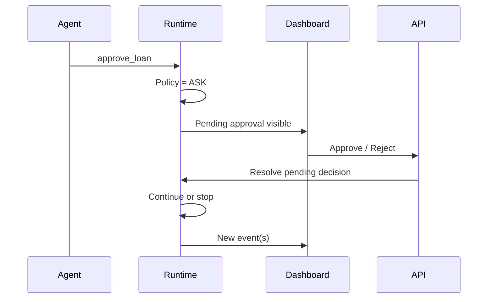

# AgentAssure — Week 2 | Person 3 Build + Integration + Verification Plan

> **Role:** Governance controls owner + final integrator / verifier
>
> **Sequence:** Week 1 → Person 1 → Person 2 → **Person 3**
>
> **Primary goal:** Complete the remaining Week 2 governance-control features and then verify that Person 1 + Person 2 + Person 3 form one coherent Week 1 + Week 2 system with real runtime behaviour.

---

# 1. Most Important Responsibility

Person 3 is **not only another feature developer**.

Person 3 is also the final Week 2 integration checkpoint.

Before accepting the implementation, verify:

```text
Week 1 runtime
      ↓
Person 1 backend
      ↓
Person 2 dashboard
      ↓
Person 3 controls
      ↓
Full integrated demo
```

The final question is:

> Can the team demonstrate that the same real agent execution is observed, governed, enforced and evidenced through the Week 2 control plane without contradictory states?

Do not mark the project complete merely because individual components appear functional.

---

# 2. Read and Validate All Previous Work First

Before substantial coding, inspect:

```text
Week 1 implementation
Person 1 handoff
Person 2 handoff
API contracts
Event model
Evidence model
Policy model
Dashboard structure
Tests
```

Run the existing test suite before changing anything.

Record:

```text
baseline tests passing
baseline tests failing
known limitations
```

If a previous implementation is broken, determine whether it is:

```text
Week 1 defect
Person 1 integration defect
Person 2 frontend defect
environment/setup issue
```

Fix real integration defects instead of hiding them.

---

# 3. Your Scope

Person 3 owns two categories of work.

## A. Remaining Week 2 features

```text
1. Policy management backend
2. Policy Studio UI
3. Policy editing/version handling needed now
4. Policy validation
5. Scope controls
6. Approval Queue UI
7. Approval resolution flow
8. Approval evidence display
9. Final metric polish where required
```

## B. Final verification and integration

```text
10. Week 1 regression verification
11. End-to-end runtime/control-plane tests
12. Policy-change demo verification
13. Block/ASK execution consistency checks
14. DAG/log/evidence cross-correlation checks
15. Evidence integrity checks
16. Full Week 1 + Week 2 dry runs
17. Final cleanup and documentation
```

---

# 4. Non-Negotiable Runtime Invariants

Throughout implementation and testing, repeatedly verify:

```text
ALLOW → underlying tool executes
BLOCK → underlying tool does not execute
ASK   → protected action remains pending
```

A UI action must never bypass the runtime governance path.

The architecture must remain:

```text
UI
 ↓
API
 ↓
Governance / approval service
 ↓
Existing runtime enforcement path
 ↓
Tool execution or non-execution
```

Not:

```text
UI → directly execute tool
```

---

# 5. Policy Studio

Implement real policy controls using the existing Week 1 policy model.

Show:

```text
Policy ID
Name
Description
Scope
Trigger
Condition
Severity
Action
Mode
Version
Enabled/Disabled
```

Example:

```text
FIN-001
Loan approval limit

Scope:
    Agent = loan-agent
    Environment = demo
    Tool = approve_loan

Condition:
    args.amount > 500000

Action:
    BLOCK

Mode:
    ENFORCE

Version:
    1
```

Do not invent a second policy language.

Use the runtime's actual policy representation.

---

# 6. Policy Editing

The most important Week 2 governance demo is:

Current:

```text
amount > ₹500,000 → BLOCK
```

Change:

```text
amount > ₹500,000 → ASK
```

Run the same request again.

Expected:

```text
Before:
approve_loan → BLOCK

After:
approve_loan → ASK
```

The agent code must not change.

Also support a practical threshold modification if the current policy model makes it clean:

```text
₹500,000 → ₹1,000,000
```

Then:

```text
₹800,000 → ALLOW
```

Use this to prove governance is external to agent business logic.

---

# 7. Policy Validation

Invalid definitions must not silently become active policies.

Flow:

```text
Edit
 ↓
Validate
 ↓
Show errors
 ↓
Save only if valid
```

Example error:

```text
Condition field "args.amount" is not valid for this tool.
```

Validation should catch at least:

```text
missing required fields
invalid action
invalid mode
malformed condition
unknown tool/scope field where the model can validate it
invalid threshold/value type
```

Do not build a full enterprise policy compiler.

---

# 8. Policy Scope Controls

Make scope visible and understandable.

Support the scope dimensions already planned:

```text
Agent
Environment
User / Role
Tool
Tool category
Data classification
```

A simple form is enough.

Do not build a full IAM system.

The purpose is to demonstrate that policies can apply to a defined context rather than globally to everything.

---

# 9. Policy Lifecycle Preparation

The model should be structured so Week 3 can support:

```text
DRAFT
  ↓
TEST / SIMULATE
  ↓
SHADOW
  ↓
ENFORCE
```

For Week 2, at minimum support the model fields needed for:

```text
version
mode
enabled/disabled
```

Full replay/simulation/shadow analytics can remain Week 3 unless already trivial.

---

# 10. Approval Queue

Build the operator-facing approval screen from the real approval backend.

Show:

```text
Approval ID
Time
Agent
Trace
Tool
Arguments
Policy
Policy version
Reason
Status
```

Example:

```text
PENDING APPROVAL

Agent: loan-agent
Tool: approve_loan
Amount: ₹800,000
Policy: FIN-001 v1
Reason: Amount exceeds configured limit

[Approve]   [Reject]
```

---

# 11. Approval Resolution

The core flow is:



The dashboard must update based on real runtime state.

### Expected behaviour

Approve:

```text
PENDING
 ↓
APPROVED
 ↓
protected tool executes
 ↓
trace continues
 ↓
evidence records approval + execution
```

Reject:

```text
PENDING
 ↓
REJECTED
 ↓
protected tool does not execute
 ↓
trace records rejection
 ↓
evidence updated
```

---

# 12. Approval Safety Checks

Test that:

```text
unknown approval → rejected cleanly
already resolved approval → cannot be resolved twice
rejected approval → cannot execute later
approved approval → corresponds to exactly one pending event
```

Do not allow the dashboard to create an approval for an event that was never actually ASKed by the runtime.

---

# 13. Approval Evidence

The final evidence should make the human intervention visible.

Include where supported:

```text
approval_id
trace_id
span_id
event_id
policy_id
policy_version
original reason
requested time
resolution
resolver
resolution time
execution outcome
```

The final drill-down should explain:

```text
Agent attempted action
→ policy required approval
→ human decision occurred
→ runtime followed that decision
→ resulting execution was recorded
```

---

# 14. Final Dashboard Integration

Make sure the finished dashboard feels like one application.

The main navigation should support:

```text
Overview
Live Monitor
Traces
Policies
Approvals
Evidence
```

A user should be able to move:

```text
Live run
 ↓
Trace
 ↓
Node
 ↓
Policy
 ↓
Approval if ASK
 ↓
Logs
 ↓
Evidence
 ↓
Integrity
```

Do not leave obvious dead-end screens or duplicate representations of the same data.

---

# 15. Final Integration Invariant: One Event, One Truth

Pick a blocked or approval-required event and verify that every layer tells the same story.

For example:

```text
DAG:
    approve_loan = BLOCKED

Event:
    decision = BLOCK

Policy:
    FIN-001 v1

Log:
    policy matched

Execution:
    NOT EXECUTED

Evidence:
    BLOCK + reason + policy version
```

If one layer says ALLOW and another says BLOCK, the system is not complete.

---

# 16. Final End-to-End Tests

These tests are the main responsibility of Person 3.

## Test 1 — Week 1 regression

Run all Week 1 tests.

Confirm:

```text
Agent instrumentation works
Events are correct
Policy evaluation works
ALLOW/BLOCK/ASK semantics still work
Evidence is stored
Evidence integrity works
```

---

## Test 2 — Normal execution

```text
User request
→ agent starts
→ live events appear
→ trace/DAG builds
→ tools execute where permitted
→ trace completes
→ evidence persists
```

Check consistency between:

```text
runtime logs
REST event data
WebSocket events
DAG
final evidence
```

---

## Test 3 — Block before execution

Use:

```text
loan amount = ₹800,000
```

With:

```text
amount > ₹500,000 → BLOCK
```

Expected:

```text
policy matches
→ BLOCK
→ approve_loan does NOT execute
→ DAG shows BLOCKED
→ logs show skipped execution
→ evidence records BLOCK
```

This is one of the most important acceptance tests.

---

## Test 4 — Policy change without agent-code change

1. Start with:

```text
amount > ₹500,000 → BLOCK
```

2. Run ₹800,000 request.

3. Verify BLOCK.

4. Change policy to:

```text
amount > ₹500,000 → ASK
```

5. Run the exact same request.

6. Verify:

```text
ASK
→ pending approval
→ no execution yet
```

This demonstrates externalized governance.

---

## Test 5 — Approve

Resolve the pending approval as APPROVE.

Expected:

```text
approval approved
→ runtime continues
→ approve_loan executes
→ new execution/result events appear
→ DAG updates
→ evidence records approval + execution
```

---

## Test 6 — Reject

Repeat with REJECT.

Expected:

```text
approval rejected
→ approve_loan does NOT execute
→ trace records rejection
→ evidence records rejection
```

---

## Test 7 — Historical reconstruction

After a run completes:

```text
refresh dashboard
→ reopen trace
→ DAG reconstructs correctly
→ event details still match
→ logs are available
→ evidence is available
→ integrity verification passes
```

This proves Week 2 is not only a live animation.

---

## Test 8 — WebSocket failure resilience

During a run:

```text
disconnect dashboard/WebSocket
→ agent keeps executing
→ evidence keeps persisting
→ reconnect or refresh
→ historical state reconstructs
```

The UI must not be the source of truth.

---

## Test 9 — Correlation consistency

For at least one selected node verify:

```text
event_id is consistent across UI/API/log/evidence
trace_id is consistent across all layers
span_id identifies the correct operation
parent_span_id builds the correct DAG relationship
```

---

## Test 10 — Evidence tamper check

Use a controlled test fixture to alter an evidence record/hash chain entry.

Expected:

```text
verify endpoint → invalid / integrity failure reported
```

Then restore the valid fixture and verify success.

Do not modify production/demo data destructively just to create this test.

---

# 17. Final Week 2 Acceptance Matrix

Before saying Week 2 is complete, verify:

| Capability | Must work | Real data | Checked by Person 3 |
|---|---|---|---|
| Week 1 runtime | Yes | Yes | Yes |
| AgentEvent tracing | Yes | Yes | Yes |
| Policy evaluation | Yes | Yes | Yes |
| ALLOW/BLOCK/ASK enforcement | Yes | Yes | Yes |
| Evidence persistence | Yes | Yes | Yes |
| REST traces/events | Yes | Yes | Yes |
| WebSocket live events | Yes | Yes | Yes |
| Live monitor | Yes | Yes | Yes |
| Dynamic DAG | Yes | Yes | Yes |
| Node drill-down | Yes | Yes | Yes |
| Runtime logs | Yes | Yes | Yes |
| Policy Studio | Yes | Yes | Yes |
| Policy validation | Yes | Yes | Yes |
| Policy editing | Yes | Yes | Yes |
| Scope controls | Yes | Yes | Yes |
| Approval queue | Yes | Yes | Yes |
| Approval resolution | Yes | Yes | Yes |
| Approval evidence | Yes | Yes | Yes |
| Evidence verification | Yes | Yes | Yes |
| Overview metrics | Yes | Yes | Yes |

If any row is only mocked, hard-coded, or manually simulated for the primary demo, it should not be marked complete.

---

# 18. Final Primary Demo — One Continuous Story

The best final Week 2 demo is one connected sequence.

## Phase 1 — Observe

Run the loan agent.

Show:

```text
Live Monitor
→ events arrive
→ DAG builds
```

## Phase 2 — Govern

Open Policy Studio.

Show:

```text
FIN-001
amount > ₹500,000
→ BLOCK
```

## Phase 3 — Enforce

Run ₹800,000 loan request.

Show:

```text
approve_loan
→ BLOCK
→ tool not executed
```

## Phase 4 — Explain

Click the blocked node.

Show:

```text
Event
Policy
Policy version
Decision
Reason
Logs
Evidence
Integrity
```

## Phase 5 — Change governance

Change:

```text
BLOCK → ASK
```

without changing agent code.

Run the same request again.

## Phase 6 — Human approval

Show:

```text
Pending approval
→ Approve
→ runtime continues
→ protected tool executes
→ trace updates
→ evidence records approval
```

This single story demonstrates the main AgentAssure value proposition.

---

# 19. What Is Not Week 2

Do not let final integration work expand into Week 3 scope.

Do not add unless trivial and explicitly justified:

```text
Full replay engine
Policy simulation engine
Advanced shadow analytics
Behaviour anomaly ML
Complex data lineage
Production SIEM connectors
Multi-agent orchestration
Enterprise IAM
Kubernetes
Kafka/Redis distributed infrastructure
```

Week 2 should finish as a coherent runtime control plane, not a collection of unfinished advanced modules.

---

# 20. Code Quality and Cleanup Pass

After functional tests pass:

```text
remove dead code
remove temporary mocks from primary demo paths
remove hard-coded demo graph logic
remove duplicate event models
check error handling
check startup/shutdown behaviour
check logging
check README/demo commands
```

Ensure environment configuration is understandable.

Ensure a fresh clone can follow the documented setup path.

---

# 21. Definition of Done — Person 3

Person 3 is complete only when all of the following are true:

### Governance features

```text
[ ] Policy Studio works
[ ] Policy editing changes real runtime behaviour
[ ] Policy validation prevents invalid active definitions
[ ] Policy scopes are visible and usable
[ ] Approval Queue works
[ ] Approve/reject follows runtime enforcement path
[ ] Approval evidence is recorded
```

### Integration

```text
[ ] Week 1 + Person 1 + Person 2 code works together
[ ] REST and WebSocket data agree
[ ] DAG and span relationships agree
[ ] Event/policy/log/evidence correlation works
[ ] UI does not bypass enforcement
[ ] Historical reconstruction works
[ ] WebSocket failure does not lose evidence
```

### Verification

```text
[ ] Week 1 regression suite passes
[ ] Normal run passes
[ ] Block run passes
[ ] ASK run passes
[ ] Approve run passes
[ ] Reject run passes
[ ] Policy-change run passes
[ ] Evidence integrity test passes
[ ] Full demo run passes end-to-end
```

---

# 22. Final Project Report

At the end, provide a final Week 2 integration report:

```text
1. Files created/changed
2. Features completed by Person 3
3. Person 1 work verified
4. Person 2 work verified
5. Week 1 regression results
6. Week 2 integration test results
7. Primary demo result
8. Exact commands to run the project
9. Known defects/limitations
10. Anything deferred to Week 3
11. Any deviations from the original Week 2 specification
12. Recommended final demo order
```

For every failed or deferred item, state the actual reason. Do not hide incomplete work behind UI screenshots.

---

# 23. Final Mental Model

Person 3 should be able to explain the complete Week 1 + Week 2 system as:

```text
Existing Agent
      ↓
AgentAssure Adapter
      ↓
Canonical Event / Trace
      ↓
Policy Evaluation
      ↓
ALLOW / BLOCK / ASK
      ↓
Real Enforcement
      ↓
Evidence
      ↓
REST + WebSocket
      ↓
Dashboard
      ↓
DAG / Event / Policy / Logs / Evidence
      ↓
Operator changes policy or resolves approval
      ↓
Runtime follows the new governance decision
```

The key proof is not that the dashboard looks good.

The key proof is:

> **The dashboard reflects the real runtime, the runtime enforces the policy, and the evidence proves what actually happened.**
